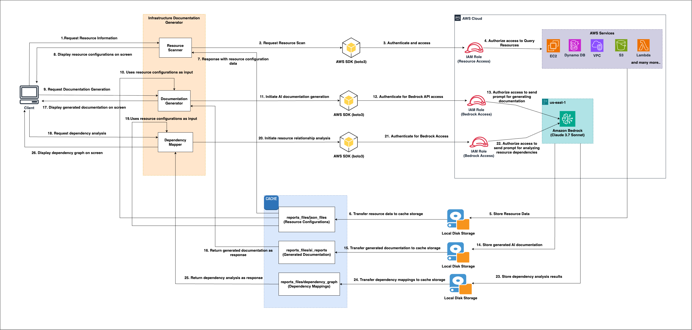

# AWS Infra Documentation Generator & Knowledge Base

The Infrastructure Document Generator is an intelligent automation tool that revolutionizes AWS infrastructure documentation and analysis. By automatically scanning cloud environments, it creates comprehensive, real-time documentation with detailed configuration reports, including dependency maps of resources based on access policies. The tool goes beyond basic documentation by providing actionable insights based on AWS Well-Architected Framework principles, providing reports on Security Best Practices, Comprehensive Analysis and Performance Improvement, enabling organizations to optimize their cloud infrastructure while maintaining accurate documentation with minimal effort.

## Architecture



### Architecture Workflow

#### RESOURCE SCANNING PHASE:

1. **Request Resource Information**: The process begins when a client sends an initial request to the system to gather information about their AWS infrastructure.

2. **Request Resource Scan**: The Resource Scanner component activates and prepares to scan multiple AWS services (Amazon EC2, Amazon DynamoDB, Amazon VPC, Amazon S3, AWS Lambda, etc.). It formulates the appropriate API calls to collect comprehensive infrastructure data.

3. **Authenticate and Access**: The system uses the AWS SDK (boto3) to interact with AWS services by making authenticated API requests using the provided credentials. This establishes a valid session for retrieving resource information.

4. **Authorize Access to Query Resources**: IAM role permissions are verified to confirm the scanner has the appropriate access rights to query the required AWS services. This serves as a crucial security check before retrieving resource data.

5. **Store Resource Data**: The system collects detailed configuration data from various AWS services, including instance details, network configurations, storage settings, and service relationships.

6. **Transfer Resource Data to Cache Storage**: The collected data is efficiently moved to local disk cache storage. This enables faster access and reduces repeated API calls to AWS services, improving performance.

7. **Respond with Resource Configuration**: The system compiles the collected data into a structured format suitable for client consumption and prepares it for transmission back to the client.

8. **Display Resource Configurations**: The formatted resource configuration data is presented to the client through the interface, showing detailed insights into their AWS infrastructure.

#### DOCUMENTATION GENERATION PHASE:

9. **Request Documentation Generation**: The client initiates the documentation process based on the scanned resource data, triggering the Documentation Generator component.

10. **Use Resource Configurations**: The system retrieves cached resource data from the scanning phase to serve as the foundation for documentation generation.

11. **Initiate AI Documentation Generation**: The system begins the AI-powered documentation process using Amazon Bedrock, preparing the necessary context and prompts for documentation creation.

12. **Authenticate for Bedrock API**: The system establishes a connection to Amazon Bedrock by making authenticated API requests with valid credentials.

13. **Authorize Access for Documentation**: IAM permissions are verified to ensure the system is allowed to use Bedrock for generating documentation.

14. **Store Generated AI Documentation**: The AI-generated documentation is saved in persistent storage for future reference.

15. **Transfer Documentation to Cache**: The generated documentation is copied into cache storage for quicker access and performance.

16. **Return Documentation Response**: The system formats and sends the generated documentation back to the client.

17. **Display Documentation**: The documentation is presented to the client via the interface in a clear and organized format.

#### DEPENDENCY MAPPING PHASE:

18. **Request Dependency Analysis**: The client initiates the process to analyze and map relationships between AWS resources.

19. **Use Resource Configurations**: The system accesses cached resource data from the scanning phase to identify interdependencies among resources.

20. **Initiate Relationship Analysis**: The Dependency Mapper processes the resource data to identify and map connections between AWS services.

21. **Authenticate for Bedrock**: The system establishes a connection to Amazon Bedrock by making authenticated API requests with valid credentials.

22. **Authorize Access for Dependency Analysis**: IAM permissions are verified to ensure the system can use Bedrock for dependency analysis tasks.

23. **Store Dependency Results**: The completed dependency analysis results are saved in persistent storage.

24. **Transfer Mappings to Cache**: Dependency mapping data is moved into cache storage for faster access and reuse.

25. **Return Dependency Response**: The system prepares and sends the dependency analysis results back to the client.

26. **Display Dependency Graph**: The final dependency relationships are visualised and shown to the client as an interactive graph, illustrating service connections and resource dependencies.

---

## Features

The Infrastructure Documentation Generator is built in Python with FastAPI for deployment and a React-based user interface for visualization. Its architecture consists of three key modular components:

### 1. Resource Scanning
- Discovers and inventories AWS resources across regions
- Enumerates resources from services like EC2, S3, Lambda, DynamoDB
- Extracts resource-based policies from applicable services
- Normalizes and filters fields for consistent output
- Returns structured JSON data for downstream processing

### 2. Documentation Generation
- Leverages Amazon Bedrock (Claude) for AI-powered analysis
- Produces detailed Markdown documentation with actionable recommendations
- Implements intelligent chunking for large datasets
- Supports multiple analysis types (comprehensive, security, cost, performance)
- Handles retries and errors with exponential backoff

### 3. Dependency Mapping
- Analyzes relationships between AWS resources
- Builds comprehensive service interaction graphs
- Extracts and processes resource policies and identifiers
- Constructs uniform ARN representations
- Generates interactive graph visualizations

---

## Supported AWS Services

The solution currently supports **66 AWS services** across multiple categories:

### Compute Services
- **EC2**: Instances, Security Groups, VPCs, Subnets, Route Tables, Internet Gateways, NAT Gateways, Volumes, Snapshots, Images, Transit Gateways
- **Lambda**: Functions, Layers
- **ECS**: Clusters
- **EKS**: Clusters
- **Batch**: Compute Environments, Job Queues, Job Definitions
- **Elastic Beanstalk**: Applications, Environments
- **Lightsail**: Instances, Load Balancers, Databases, Static IPs, Buckets, Disks

### Storage Services
- **S3**: Buckets
- **EFS**: File Systems
- **FSx**: File Systems, Backups
- **Backup**: Backup Vaults, Backup Plans

### Database Services
- **RDS**: DB Instances, DB Clusters, DB Snapshots
- **DynamoDB**: Tables
- **ElastiCache**: Cache Clusters, Serverless Caches, Subnet Groups, Parameter Groups
- **DocumentDB**: DB Clusters, DB Instances
- **Neptune**: DB Clusters, DB Instances
- **Redshift**: Clusters

### Networking Services
- **CloudFront**: Distributions
- **Route 53**: Hosted Zones
- **API Gateway**: REST APIs
- **Direct Connect**: Connections, Virtual Interfaces
- **Global Accelerator**: Accelerators
- **Network Firewall**: Firewalls, Firewall Policies
- **ELB/ALB/NLB**: Load Balancers, Target Groups

### Security & Identity Services
- **IAM**: Users, Groups, Roles, Policies
- **KMS**: Keys
- **Secrets Manager**: Secrets
- **ACM**: Certificates
- **Shield**: Protections
- **GuardDuty**: Detectors
- **WAF/WAFv2**: Web ACLs
- **Macie**: Classification Jobs

### Application Integration Services
- **SNS**: Topics
- **SQS**: Queues
- **EventBridge**: Rules, Event Buses
- **Step Functions**: State Machines
- **MQ**: Brokers

### Analytics Services
- **Kinesis**: Streams
- **Elasticsearch/OpenSearch**: Domains, VPC Endpoints
- **OpenSearch Serverless**: Collections, VPC Endpoints, Security Policies
- **Athena**: Work Groups, Data Catalogs
- **Glue**: Databases, Crawlers, Jobs

### Machine Learning Services
- **SageMaker**: Notebook Instances, Training Jobs, Endpoints
- **Comprehend**: Document Classification Jobs, Entity Recognizers
- **Bedrock**: Foundation Models, Custom Models, Evaluation Jobs, Provisioned Models
- **Bedrock Agent**: Agents, Knowledge Bases

### Developer Tools
- **CodeCommit**: Repositories
- **CodeBuild**: Projects
- **CodePipeline**: Pipelines
- **CodeArtifact**: Domains
- **ECR**: Repositories

### IoT Services
- **IoT Core**: Things, Policies, Certificates
- **Greengrass**: Groups

### Media Services
- **MediaConvert**: Queues, Presets
- **MediaLive**: Channels, Inputs

### Migration & Transfer Services
- **DataSync**: Tasks, Locations
- **Transfer Family**: Servers

### Management & Governance Services
- **CloudFormation**: Stacks
- **CloudWatch**: Metric Alarms
- **Systems Manager**: Parameters
- **Organizations**: Accounts
- **Resource Groups Tagging API**: Resource Tag Mappings
- **Cost Explorer**: Cost Category Definitions
- **Savings Plans**: Savings Plans

### Business Applications
- **WorkMail**: Organizations
- **WorkSpaces**: Workspaces

### Resource-Based Policy Support

The solution extracts and analyzes resource-based policies for the following services:
- **Lambda**: Function resource policies
- **SQS**: Queue access policies
- **SNS**: Topic access policies
- **S3**: Bucket policies
- **EC2**: Instance profile policies (IAM roles attached to instances)
- **Glue**: Resource policies
- **EventBridge**: Resource policies
- **Step Functions**: Resource policies
- **EFS**: File system policies
- **CloudWatch**: Resource policies
- **KMS**: Key policies
- **API Gateway**: Resource policies

---

## Amazon Bedrock Configuration

### Supported Regions

The solution uses **us-east-1** as the default region for Amazon Bedrock.

### Model Configuration

The solution uses **Claude 3.7 Sonnet** (us.anthropic.claude-3-7-sonnet-20250219-v1:0) as the default model.

### Prerequisites

Before using the solution, ensure Claude 3.7 Sonnet is enabled in us-east-1:
1. Go to Amazon Bedrock console in us-east-1
2. Navigate to "Model access" in the left sidebar
3. Request access to "Claude 3.7 Sonnet" if not already enabled
4. Wait for approval (usually immediate for most accounts)

---

## AWS Authentication Best Practices

### Recommended Approach: AWS SSO/IAM Identity Center

For the most secure and convenient authentication, use AWS SSO (IAM Identity Center):

1. **Configure AWS SSO Profile**:

    ```bash
    aws configure sso
    ```

    - Follow the prompts to set up your SSO profile
    - Choose a profile name (e.g., `infradocgen-dev`)

2. **Login and Use**:
    ```bash
    aws sso login --profile infradocgen-dev
    export AWS_PROFILE=infradocgen-dev
    ```

### Security Best Practices

-   **Never commit AWS credentials** to version control
-   **Use least privilege principle** - only grant necessary Bedrock permissions
-   **Rotate access keys regularly** (if using IAM users)
-   **Enable MFA** on your AWS account
-   **Use temporary credentials** when possible (SSO preferred)

## Bedrock Guardrails and Security Best Practices

### Setting Up Bedrock Guardrails

Bedrock Guardrails help protect your application from harmful content and prompt injection attacks. Here's how to implement them:

#### 1. Create a Guardrail Configuration

```python
import boto3

bedrock = boto3.client('bedrock')

# Create guardrail
guardrail_response = bedrock.create_guardrail(
    name='infradocgen-guardrail',
    description='Guardrail for InfraDocGen infrastructure code generation',
    topicPolicyConfig={
        'topicsConfig': [
            {
                'name': 'Infrastructure Security',
                'definition': 'Prevent generation of insecure infrastructure configurations',
                'examples': [
                    'Do not create resources with public access unless explicitly required',
                    'Always use encryption for data at rest and in transit'
                ],
                'type': 'DENY'
            }
        ]
    },
    contentPolicyConfig={
        'filtersConfig': [
            {
                'type': 'SEXUAL',
                'inputStrength': 'HIGH',
                'outputStrength': 'HIGH'
            },
            {
                'type': 'VIOLENCE',
                'inputStrength': 'HIGH',
                'outputStrength': 'HIGH'
            },
            {
                'type': 'HATE',
                'inputStrength': 'HIGH',
                'outputStrength': 'HIGH'
            },
            {
                'type': 'INSULTS',
                'inputStrength': 'MEDIUM',
                'outputStrength': 'MEDIUM'
            }
        ]
    },
    wordPolicyConfig={
        'wordsConfig': [
            {
                'text': 'admin123'
            },
            {
                'text': 'password123'
            }
        ],
        'managedWordListsConfig': [
            {
                'type': 'PROFANITY'
            }
        ]
    },
    sensitiveInformationPolicyConfig={
        'piiEntitiesConfig': [
            {
                'type': 'EMAIL',
                'action': 'BLOCK'
            },
            {
                'type': 'PHONE',
                'action': 'BLOCK'
            },
            {
                'type': 'AWS_ACCESS_KEY',
                'action': 'BLOCK'
            },
            {
                'type': 'AWS_SECRET_KEY',
                'action': 'BLOCK'
            }
        ]
    }
)
```

#### 2. Apply Guardrails to Model Invocation

```python
import boto3
import json

def invoke_model_with_guardrails(prompt, guardrail_id, guardrail_version):
    bedrock_runtime = boto3.client('bedrock-runtime')

    body = json.dumps({
        "anthropic_version": "bedrock-2023-05-31",
        "max_tokens": 4000,
        "messages": [
            {
                "role": "user",
                "content": prompt
            }
        ]
    })

    response = bedrock_runtime.invoke_model(
        body=body,
        modelId='us.anthropic.claude-3-7-sonnet-20250219-v1:0',
        accept='application/json',
        contentType='application/json',
        guardrailIdentifier=guardrail_id,
        guardrailVersion=guardrail_version
    )

    return response
```

### Prompt Injection Prevention Techniques

#### Input Validation and Sanitization

```python
import re
from typing import List

class PromptValidator:
    def __init__(self):
        # Common prompt injection patterns
        self.injection_patterns = [
            r'ignore\s+previous\s+instructions',
            r'forget\s+everything',
            r'new\s+instructions?:',
            r'system\s*:',
            r'assistant\s*:',
            r'human\s*:',
            r'<\s*system\s*>',
            r'<\s*\/\s*system\s*>',
            r'pretend\s+to\s+be',
            r'act\s+as\s+if',
            r'roleplay\s+as'
        ]

    def validate_input(self, user_input: str) -> tuple[bool, List[str]]:
        """Validate user input for potential prompt injection attempts"""
        violations = []

        # Check for injection patterns
        for pattern in self.injection_patterns:
            if re.search(pattern, user_input.lower()):
                violations.append(f"Potential injection pattern detected: {pattern}")

        # Check for excessive special characters
        special_char_ratio = len(re.findall(r'[<>{}[\]()"]', user_input)) / len(user_input)
        if special_char_ratio > 0.3:
            violations.append("Excessive special characters detected")

        # Check input length
        if len(user_input) > 10000:
            violations.append("Input exceeds maximum length")

        return len(violations) == 0, violations

    def sanitize_input(self, user_input: str) -> str:
        """Sanitize user input by removing potentially harmful content"""
        # Remove HTML-like tags
        sanitized = re.sub(r'<[^>]*>', '', user_input)

        # Remove excessive whitespace
        sanitized = re.sub(r'\s+', ' ', sanitized).strip()

        # Limit length
        sanitized = sanitized[:5000]

        return sanitized
```

### Implementation Best Practices

#### 1. Environment Configuration

```python
# config.py
import os
from dataclasses import dataclass

@dataclass
class SecurityConfig:
    enable_guardrails: bool = True
    guardrail_id: str = os.getenv('BEDROCK_GUARDRAIL_ID', '')
    guardrail_version: str = os.getenv('BEDROCK_GUARDRAIL_VERSION', 'DRAFT')
    max_input_length: int = 5000
    enable_input_validation: bool = True
    enable_response_validation: bool = True
    log_security_events: bool = True
```

#### 2. Logging and Monitoring

```python
import logging
from datetime import datetime

class SecurityLogger:
    def __init__(self):
        self.logger = logging.getLogger('infradocgen_security')
        self.logger.setLevel(logging.INFO)

        handler = logging.StreamHandler()
        formatter = logging.Formatter(
            '%(asctime)s - %(name)s - %(levelname)s - %(message)s'
        )
        handler.setFormatter(formatter)
        self.logger.addHandler(handler)

    def log_validation_failure(self, input_text: str, violations: List[str]):
        self.logger.warning(
            f"Input validation failed - Violations: {violations} - "
            f"Input preview: {input_text[:100]}..."
        )

    def log_guardrail_block(self, reason: str):
        self.logger.warning(f"Bedrock Guardrail blocked request: {reason}")

    def log_successful_generation(self, input_length: int, output_length: int):
        self.logger.info(
            f"Successful code generation - Input: {input_length} chars, "
            f"Output: {output_length} chars"
        )
```

### Required Additional IAM Permissions for Guardrails

Add these permissions to your IAM policy:

```json
{
    "Version": "2012-10-17",
    "Statement": [
        {
            "Effect": "Allow",
            "Action": [
                "bedrock:InvokeModel",
                "bedrock:InvokeModelWithResponseStream",
                "bedrock:CreateGuardrail",
                "bedrock:GetGuardrail",
                "bedrock:UpdateGuardrail",
                "bedrock:ListGuardrails"
            ],
            "Resource": [
                "arn:aws:bedrock:*:*:foundation-model/anthropic.claude-3-7-sonnet-*",
                "arn:aws:bedrock:*:*:guardrail/*"
            ]
        }
    ]
}
```

## Local Development Setup

### Backend API

```bash
# Clone the repository
git clone https://gitlab.aws.dev/vashivij/aws-infra-doc-generator-and-kb.git
cd aws-infra-doc-generator-and-kb

# Setup Python environment
python3 -m venv venv
source venv/bin/activate

# Configure AWS credentials (optional for CLI testing)
aws configure

# Install dependencies
pip install -r requirements.txt

# Run the API
uvicorn main:app --reload
```

### Frontend UI

```bash
# Navigate to UI folder
cd infra-ui

# Create environment file
echo "VITE_API_BASE_URL=http://127.0.0.1:8000" > .env

# Install dependencies
npm install

# Start development server
npm run dev
```

---

## API Testing

You can test the API using the **Swagger UI** provided by FastAPI.

**Swagger UI Endpoint**: `http://127.0.0.1:8000/docs`

---

## Frontend Application

A React application using AWS Cloudscape Design components to display AWS resources from infrastructure analysis.

### Features

-   Displays AWS resources organized by service and region
-   AI-powered infrastructure analysis and documentation
-   Interactive dependency graphs with drag-and-drop functionality
-   Real-time progress tracking for analysis operations
-   Clean, responsive UI using AWS Cloudscape Design components
-   Context API for data fetching and state management

### Prerequisites

-   Node.js (v20 or later)
-   npm or yarn
-   Running backend API

### Usage

1. Start the backend API server
2. Launch the frontend application
3. Navigate to `http://localhost:3000`
4. Use the interface to scan AWS infrastructure and generate documentation
